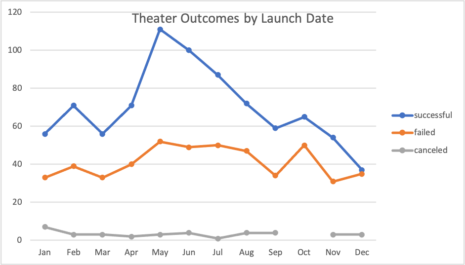
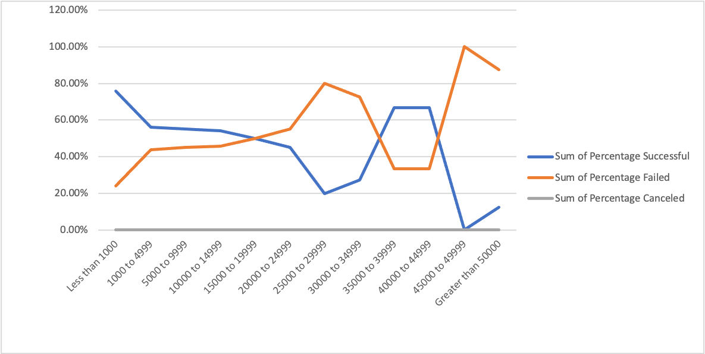

# Kickstarter-analysis
Performing the analysis on kickstarter data to uncover trends

## Overview of Project:
Helping Louise analyze how to get the funding in the fundraising campaign from organizing, sort and analyzing the data to finding the way to get Louise’s success. Giving her ideas about the campaign, and finding a similar case as a reference.

## Analysis and Challenges:
### Analysis of Outcomes Based on Launch Date
It can be seen from the graph that May has the highest number of successes. Although there is no cancellation data from September to November, the number of failures has increased significantly. By the end of December, the number of successes has dropped to the same level as failures. Therefore, May is the most suitable time to start the project.

### Analysis of Outcomes Based on Goals
15,000 to 19,999 is a watershed, the success rate of less than 15,000 will be higher than the failure rate, but greater than 15000, the failure rate will be greater than the success rate. And between 35,000 and 39,999, the success rate returned to a level higher than the failure rate. There are almost no successful cases in the range of 45,000 to 49,999. Because Louise’s budget is above 10,000, she only needs to consider the range of 10,000 to 14,999. When it is close to 14,999, the success rate will decline. Therefore, on the premise that the budget can be met, the target can be set at about 13,000.

### Challenges and Difficulties Encountered
Excel is not strange software to me, but there are many functions that I rarely touch. Through the pre-class preview and the study in class, such as counties statement, I only know how to apply it in a table, but the requirements between two tables and multiple reference items make me feel very difficult. Finally, I found the answer through research and thinking.

This project is complex because I have not understood and contacted this company and project. Before I start to analyze, I need to understand this project and related information before analyzing and summarizing it.

## Results:

* What are two conclusions you can draw about the Theater Outcomes by Launch Date?

The two conclusions that I can draw from the Theater Outcomes by Launch Date data are the best period and the worst period of the fundraising. First of all, May is a good month to launch. It is the period with the highest number of successes, far higher than the number of failures. Secondly, December is not a good time to launch, because the number of successes and failures is almost the same, and the chance of success is petty low. Therefore, Louis can choose May for her project. 

* What can you conclude about the Outcomes based on Goals?

From the analysis of the outcome of plays, the target amount range is between 45,000 and 49,999, with the highest failure rate and the lowest success rate, with almost no success. The interval between 25000 and 29999 is the second-highest failure rate. The success rate below 15,000 is higher than the failure rate. Louise needs more than 10,000 funds, so she can choose the range of 10,000 to 14,999 to be her fundraising goal.

* What are some limitations of this dataset?

I think that some limitations of the analysis of these data are that they have different currencies, so the comparison results are not accurate.

* What are some other possible tables and/or graphs that we could create?

We can also analyze the relationship between the number of supporters and the results (success, failure, cancellation). Or we can get outcomes based on countries, then Louise could focus on high responds area. 

## Recommendations
1. Louise starts her fundraising on May.
2. Louise sets up her fundraising amount as 10,000 to 14,999.
3. Louise found out the U.S an G.B

